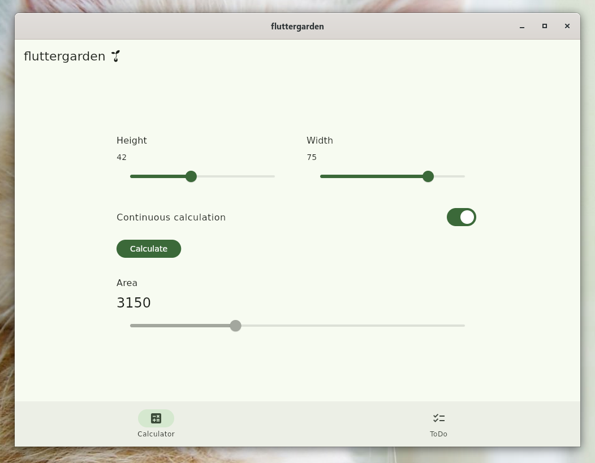
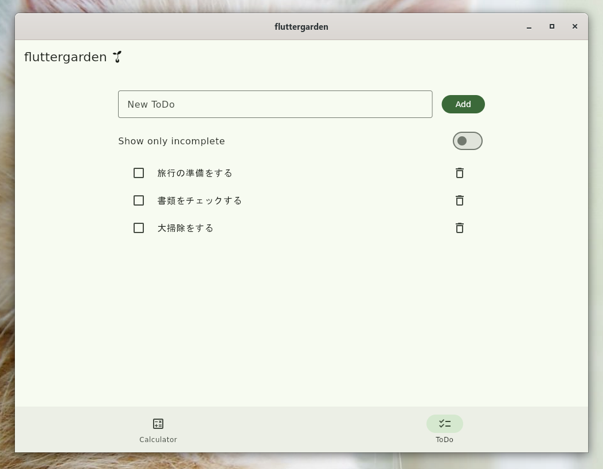

# fluttergarden 🌱

Flutterの宣言的UIとアプリアーキテクチャを学ぶための、Linuxデスクトップ向けサンプルアプリです。

## Features

- 高さと幅から面積を求めるCalculator
- 追加、編集、完了切り替え、削除、絞り込みができるToDo
- providerとChangeNotifierを使った状態管理
- RepositoryによるJSONファイルへの永続化
- Unit TestとWidget Test

## Screenshots

<p>
  
  
</p>

## Development environment

現在は次の環境で開発しています。

- Debian 13 on WSL2
- WSLg
- Visual Studio Code
- Flutter stable channel

Android SDKやAndroid Emulatorは必要ありません。

## Setup

### 1. Install Linux desktop dependencies

DebianやUbuntuなどの`apt`を使う環境では、Flutter SDKの導入前に次のパッケージをインストールします。

```console
$ sudo apt update
$ sudo apt install -y \
    curl git unzip xz-utils zip libglu1-mesa \
    clang cmake ninja-build pkg-config libgtk-3-dev libstdc++-12-dev \
    mesa-utils
```

### 2. Install Flutter SDK

Flutter SDK本体は`apt`ではなく、公式の最新手順に従ってstableチャンネルをインストールします。Dart SDKはFlutter SDKに同梱されています。

- [Install Flutter](https://docs.flutter.dev/install)
- [Set up Linux desktop development](https://docs.flutter.dev/platform-integration/linux/setup)

Visual Studio Codeを使う場合は、Flutter拡張機能をインストールし、公式の[VS Code向け手順](https://docs.flutter.dev/install/with-vs-code)からSDKを導入できます。

### 3. Validate the environment

```console
$ flutter doctor -v
$ flutter devices
```

`flutter devices`に`Linux (desktop)`が表示されれば準備完了です。

## Run

```console
$ flutter pub get
$ flutter run -d linux
```

## Analyze and test

静的解析を実行します。

```console
$ flutter analyze
```

Unit TestとWidget Testをまとめて実行します。

```console
$ flutter test
```

## Build

Linux向けのリリースビルドを作成します。

```console
$ flutter build linux --release
```

成果物は`build/linux/x64/release/bundle/`に生成されます。実行時は、実行ファイルだけでなく`bundle`ディレクトリ全体が必要です。
